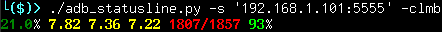

==============
adb_statusline
==============
``adb_statusline`` is a python script for displaying various simple information about a connected android phone via ``adb``. This information is colorized and formatted for either shell usage (via ANSI escapes) or ``tmux`` usage.

Features
========
* Show the load average of the connected android device
* Show the CPU usage percentage of the connected android device
* Show the RAM usage of the connected android device
* Show the battery percentage of the connected android device
* Each of these can display multiple times, in any order
* Able to output in either ANSI escapes or ``tmux`` style color
* Drains your battery

Usage
=====
::

    usage: adb_statusline.py [-h] [-s SPECIFIC] [-t] [-l] [-m] [-b] [-c]
    
    A statusline to display android phone info for shell and tmux via adb
    
    optional arguments:
      -h, --help            show this help message and exit
      -s SPECIFIC, --specific SPECIFIC
                            Use a specific device, otherwise, use the first
      -t, --tmux            Use tmux-style colors
      -l, --load            Display load average (action)
      -m, --memory          Display memory useage, in megabytes (action)
      -b, --battery         Display battery percentage (action)
      -c, --cpu             Display cpu usage percentage (action)

At least one "action" must be selected for the script to actually do anything!

Example
-------

::

    $ ./adb_statusline.py -s '192.168.1.101:5555' -clmb
    
    21.0% 7.82 7.36 7.22 1807/1857 93%

.. list-table:: *Arguments*
    :widths: 20 20 20
    
    * - ./adb_statusline.py
      - -s '192.168.1.101:5555'
      - -clmb
    * - Script name
      - Device ID to use, optional
      - Actions to take, in that order

.. list-table:: *Output*
    :widths: 20 20 20 20

    * - 21.0%
      - 7.82 7.36 7.22
      - 1807/1857
      - 93%
    * - CPU usage percent
      - Load averages
      - Memory usage
      - Battery percent

Limitations
===========
* Occasionally, the command ``adb shell dumpsys cpuinfo``'s last line reports anomalous CPU usage (in the format ``-x.-y`` where both x and y are numbers). When this happens the CPU usage field will display an 'X'. This seems to be a bug in android, at least in version 7.1.1 on the Nexus 5x.
* By default, ``tmux`` refreshes the status bar every 2 seconds. This script takes around 0.35 seconds to run on a i5 4440 in a VM (2 cores). On a (simulated) busy system, this time can spike to 1.1 seconds! If you are worried about your system not being quick enough, try timing the execution of the script with ``time`` several times to see how long it takes on average.

Installation
============
Requirements
------------
* Python >= 3.5
* ``tmux`` and terminal which supports 256color
* ``adb``
* Tested with android 7.1.1
* The amazing `colored <https://pypi.python.org/pypi/colored/>`_ module for python
* A willingness to charge your phone more frequently
* TODO: FINISH ME AFTER FINISHING THE SCRIPT

Instructions
------------
TODO: FINISH ME AFTER FINISHING THE SCRIPT

Why?
====
I've previously made a version of this script in bash (unreleased), and felt like improving upon its functionality while also learning a more comprehensive language. Also I enjoy seeing colorful numbers in my tmux status bar, and picking up one's phone to check the battery is far too difficult! Hopefully someone else will also find this useful!

Inspiration
===========
Other ``tmux`` status line utilities, including `tmux-top <https://github.com/TomasTomecek/tmux-top>`_ and `tmux-mem-cpu-load <https://github.com/thewtex/tmux-mem-cpu-load>`_.

TODO
====
See `<TODO.rst>`_

License
=======
GPLv3